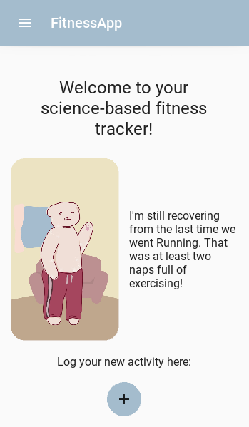
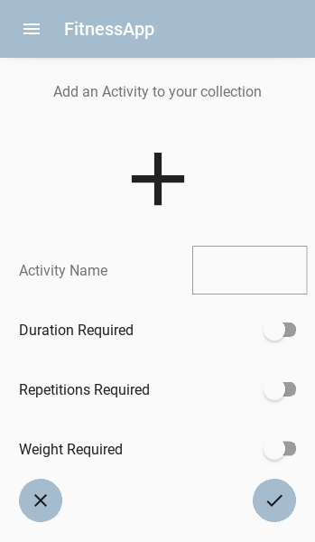
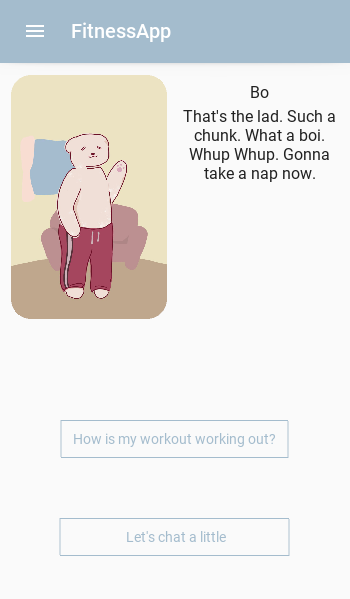
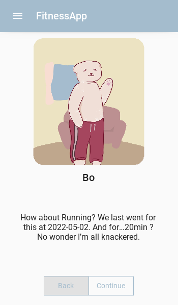

*Last updated on 03 May, written by jegny100 & palebDUE*
# Science Based Fitness Tracker App

|                      |                   |                |   |
| -------------------- | ----------------- | -------------- |-- |
| |  |   |  |

Keeping track of things can be quite hard and keeping track of yourself even harder. Maybe you have already tried some of the wide variety of self-quantification apps out there but found them just a bit overwhelming, with daily goals, reminders to just squeeze in a few more steps or dramatic up- and downward graphs. Finding a tool that’s not pestering you for constant improvement while also being more fun than just a sheet of paper or your phone's note app can be quite the task. That’s the niche this app is trying to fill. Log your workouts at your own pace, without any requirements attached to them. You will get positive feedback from your digital workout buddy along the way and can chat with them about your activities or whatever is at their mind at the moment.

Here is how it works: You can input any activity type you want (whether it be swimming, jogging, Quidditch or jousting) and choose a workout buddy to accompany you. Whenever you log a new workout of that type, your buddy will remember this. You can later chat with them about your workouts this week and your overall performance. Your buddy will also grow closer to you the more you two work out together and you will have more topics to talk about. They won’t judge you whenever you decide to “skip” a week or just go for a five minute stroll instead of hiking up and down the nearest mountain. They’ll just be your personal hype person - cheering you on when you keep up the pace and being understanding whenever you need a little rest.

The whole application is still very much a work in progress. The version you will find here is functional, but of course we are happy about everyone who contributes. Please feel invited to join us and add any features, lines of dialogue or whole buddies. Following you will find a description of the development journey, including the scientific background to the overall design and individual elements. You will also find a simple guide on how to use the app and ways to add new buddies or dialogue without having to comb through the existing code first.

Thank you for your time and we very much hope that you all will enjoy this little application we put together - whether it be from a user or developer side :)


# Theoretical Background

## 🎈 Call to Adventure
For our Knowledge Management course, we were on a mission to find a fun project that tackles the curriculum of our course and our personal interests. So we fell into a research rabbit hole and found self-quantification and gamification - data and games, magical words to our ears. We made a plan for the big adventure ahead of us: creating an app on a scientific foundation that combines those two topics. The outcome is a tool for personal/individual knowledge and information management for your fitness data, but there is more. You are not alone in your workouts. In our app you can add new activities to the collection according to your own favourite activities and choose a buddy that works out with you. Whenever you workout, your buddy will as well and the connection between the both of you grows stronger. You can have conversations with your buddies, like a quick chat or an overview about one of your activities. Through this, your buddy will accompany you through encouragement and insights, or just as a neat little distraction while you rest after your workout session.

If you want to learn more about our journey to the outcome, there is more from our adventure:


## Table of Content

1. [ 🧙‍♀️ Meeting the Mentor(s) & Crossing the Threshold](#Mentors)  
    1.1 [Self-Quantification](#Mentors)    
    1.2 [Gamification](#Gamification)  
	1.3 [Why do we think this is a good idea?](#Why)  
	1.4 [A few things to keep in mind](#Mind)  
2. [ ⚔️ Tests, Allies, and Enemies](#Tests)  
3. [ 💎 The Ultimate Boon](#Boon)  
	3.1 [How it works](#How)  
4. [ 🌅 Master of two Worlds](#Master)  
	4.1 [Why no visualisation?](#visualisation)  
5. [ 🔮 Sequel Bait](#Sequel)  
	5.1 [What else could be added to this concept?](#Sequel)  
	5.2 [Evaluation](#Evaluation)  
	5.3 [Code improvements](#improvements)  
6. [ 👩🏽‍💻 Implementation](#Implementation)  
	6.1 [Requirements](#Requirements)  
	6.2 [Functions](#Functions) 

<a name="Mentors"></a>
## 🧙‍♀️ Meeting the Mentor(s) & Crossing the Threshold 
### Self-Quantification

Self-Quantification is described by the Quantified Self movement as “self-knowledge through numbers” (quantifiedself.com). Users collect data about themselves and use them to gain insights into their behaviours and habits. The process of collecting data is often called self-tracking, which becomes self-quantification only after this data is put into a quantitative or qualitative context.  

> You might self-track your sleeping schedule by writing down the times you go to bed and wake up each night. If you compare these data points to each other, to see whether going to bed early means you also wake up earlier or how your sleeping schedule differs on weekends, that’s self-quantification. 

Self-quantification itself can also be split up into sub-activities (Almalki, Gray & Sanchez, 2015): First the collected data is managed, which includes digital or analog storage as well as organising it in a manner that makes it understandable for the user (and/or any self-quantification systems that interact with it). Then, users can reflect on data, by which they derive meaning from it.

> For sake of convenience, you may write down your sleeping schedule on a notepad next to your bed. Since these notes are very cluttered, you decide to copy them into a table in a separate notepad, in chronological order. This is managing your data. Once you have collected a sufficient amount of data points, you sit down with your notes, think of any questions you have, and see how your notes can answer them. By this you are reflecting on your data.

This breakdown of self-quantification fitted our idea of what our app should do really well. It furthermore gave us an in through being less focused on the psychology of physical health and exercising itself, but on the handling of the resulting data and information. With this perspective, we could relate the subject to other fields of study. As many of you will likely already have experienced, finding a path from the knowledge you already have to what you’re trying to learn can be a huge boost, and we felt the same. In particular we looked at the study of knowledge management. Probst (1998) defined the building blocks of knowledge management, which consist of an inner and outer cycle of activities. Self-quantification can assist in two activities of the outer cycle: Knowledge Measurement becoming Data Management and Knowledge Goals becoming Reflection on Data. 

<details>
<summary markdown="span">Why go into so much detail?</summary>
Splitting self-quantification (and later topics that will be brought up) into all these sub-tasks might seem nitpicky at first. It is however very useful when trying to incorporate it into another service, such as we will be doing shortly. By looking at the process in detail, we can ensure that we do not miss any important components and really understand how the whole concept is supposed to function.
</details>
Self-quantification can be applied to many aspects of life, such as nutrition, health, or exercise. Apps can be quite helpful with this, as they organise and sometimes track relevant data for the user. Some examples that you might already be using are FitBit or Google Fit, which both track various exercise related data, organise them into daily, weekly, and monthly overviews, and assist in self-reflection, by pointing out increases and decreases. 

Overall, self-quantification is meant to increase awareness, curiosity, and consciousness (Orji, 2018). It can show problematic behaviour that users may not have noticed otherwise and inspire to improve oneself by comparing data to others’ or the former self’s. But of course it also has some disadvantages and weaknesses. Continuously striving to best one self or others can turn into unhealthy behaviour, if it disregards other needs. When using tools such as apps, these apps often assume that users are already motivated to quantify themselves and offer little motivational affordances outside of self-quantification. This is a weak point especially since people can perceive feedback quite differently, based on how control or autonomy oriented they are (Mekler, Brühlmann, Tuch & Opwis, 2017). Control oriented users may feel controlled by receiving feedback, while autonomy oriented users will see it as informational and feel more competent. These last two points (lack of motivational affordances and differences in perception) made us look for another motivational factor, which might mitigate these effects.

| **Sources** |
|-------------|
|Quantified Self. What is Quantified Self? Retrieved from https://quantifiedself.com/about/what-is-quantified-self/ <br/><br/> Almalki, M., Gray, K., & Sanchez, F. M. (2015). The use of self-quantification systems for personal health information: big data management activities and prospects. Health information science and systems, 3(1), 1-11. <br/><br/> Orji, R. (2018). The Costs and Benefits of Self-Monitoring for Health and Wellness. Retrieved from:  https://blogs.ucl.ac.uk/cbc-digi-hub-blog/2018/09/21/the-costs-and-benefits-of-self-monitoring-for-health-and-wellness/ <br/><br/> Mekler, E. D., Brühlmann, F., Tuch, A. N., & Opwis, K. (2017). Towards understanding the effects of individual gamification elements on intrinsic motivation and performance. Computers in Human Behavior, 71, 525-534. <br/><br/> Probst, G. J. (1998). Practical knowledge management: A model that works. PRISM-CAMBRIDGE MASSACHUSETTS-, 17-30.|

<a name="Gamification"></a>
### Gamification
Gamification describes the use of game design elements in a non-game context, which are intended to motivate and engage users (Deterding, Dixon, Khaled, & Nacke, 2011). As more and more people are picking up gaming as a hobby and become more familiar with game elements, gamification is likewise being used to enhance services more often. It is related to subjects such as educational games, but differs in the way that the main activity performed is not a game, but simply incorporates gameful features.

> As a child you may have studied to improve your language skills by playing learning games and helping your favourite cartoon characters sort vocabulary, fight declination monsters, or unravel past tenses. This would be an educational game, not gamification, as the main activity was still gaming (and you were merely tricked into studying). Nowadays you may want to brush up on your language skills with the aid of an online learning platform such as Duolingo. In this app you can collect badges for a variety of activities and build up a streak by completing daily lessons. This is gamification, as the main activity is learning, with game elements to motivate you to keep going.

Gamified applications most commonly feature points, badges or leader boards (Hamari, Koivisto & Sarsa, 2014). These elements are very versatile, so they can be applied to many different contexts , such as education, health, and commerce. Research on how gamification affects motivation is still ongoing. The difference between extrinsic and intrinsic motivation is something that especially interests researchers, but since these are difficult to measure directly and can only be seen in their behavioural outcomes, no definite connection can be made yet. Something that has become apparent though is that different game design elements have different effects and that the context they are being deployed in and the personality of the user matter (Dahlstrøm, 2017). Because of this they are, though efficient at times, no catch-all solution for engaging users.

<a name="Why"></a>
#### Why do we think this is a good idea?
We think gamification will be a great addition to our app design, since it can complement self-quantification in our competence-autonomy dilemma: Users will feel competent through receiving feedback about their workout progress, guided by self-quantification tools. The game design elements can be chosen to satisfy a need for autonomy, for example by allowing users to make meaningful choices and seek out intentional interactions

| **Sources** |
|-------------|
|Deterding, S., Dixon, D., Khaled, R., & Nacke, L. (2011, September). From game design elements to gamefulness: defining" gamification". In Proceedings of the 15th international academic MindTrek conference: Envisioning future media environments (pp. 9-15). <br/><br/> J. Hamari, J. Koivisto and H. Sarsa, "Does Gamification Work? -- A Literature Review of Empirical Studies on Gamification," 2014 47th Hawaii International Conference on System Sciences, 2014, pp. 3025-3034, doi: 10.1109/HICSS.2014.377. <br/><br/> Dahlstrøm, C. (2017). Impacts of gamification on intrinsic motivation. |

<a name="Mind"></a>
### A few things to keep in mind
Our two “mentors” already gave us a great theoretical foundation for further research and a plethora of features to choose from. We also felt it important to include our own experiences and intuitions into the app design - maybe not as a (figurative) mentor, but more of a sidekick. So while we had previously let research guide us to which models to build upon, we now went to look for what we personally felt was still missing and check whether these were valid points supported by empirical research.

Something that was extremely important to both of us, was that we do not want to rush users to change their behaviour or log their workouts at a certain frequency. This should firstly be reflected in the choice of features. For example, we did not want our app to send push notifications. Our intuition was that this would stress users, a claim we could not find a clear support or rebuttal for. However, a 2020 literature review (Wohllebe, 2020) found that while push notifications increase engagement with an app, they are also often perceived as a disruption or interruption. Valuing these benefits and disadvantages against each other, we decided to stick with not wanting any push notifications. 

Our commitment to a relaxed approach to self-quantification should also show in more indirect ways, such as the language used in the in-app texts. Going into detail and setting up criteria for how to do this would have been beyond the scope of this project. We instead focused on non-intrusive language, nudging users to keep engaging with the app, and allowing them the possibility to customise their experiences (Almourad, et al., 2021). This includes the option to turn off any form of nudging and instead just receiving positive feedback for logged activities. 

Another thing to keep in mind were the downsides that both self-quantification and gamification have. These were a reminder, not for the users, but for us to take things slow and consider what was actually useful and when we were going a bit overboard. For this, our sidekick needed to be a bit of a buzzkill and sit us down to look up the disadvantages of our shiny new mentor friends.
In a collection of prevalent criticisms of self-sensoring devices (Baker, 2020), tools often employed for self quantification, a lack of transparency in underlying algorithms was pointed out. By making the project code completely visible to any users, explaining our steps that led us there and presenting the logged data in a minimally processed form, we hope to counteract this. Self-quantification tools may also convey to the users a feeling of needing to know data about themselves to abide to an external degree of wellness. These standards can be set by the tool, peers or other sources. Instead of pushing users to change their behaviour to match any goals, whether they were set by us or themselves, we want to focus on simply managing and reflecting on data (Almalki, Gray & Sanchez, 2015). This should hopefully also boost self-quantification’s benefit of increased self-awareness, while alleviating the pressure to perform (Ayobi, et al., 2017).

Lastly, we wanted all our elements to fit together organically (or as organically as a digital application can be at least). While we would have probably stuck to this principle just for the sake of organising the development process, there is actually a user benefit in it as well. Especially with gamification, game design elements that aren’t tied to other elements can lead to off-task behaviour (Andrade, Mizoguchi & Isotani, 2016). This means they are a distraction from the other functions instead of enhancing them. To avoid this we always checked how a new feature would interact with the other elements and to which end goal it would be used. For example we wanted to make sure our game elements weren’t just an experience bar that kept growing with no end, but that an, hypothetical, increase in experience would also unlock new ways to use the app. 

To summarise, our sidekick, or by now our group of sidekicks, are supposed to remind us of the following principles: Take things slow and do not push users in any direction. Keep your mind open for any negative sides of self-quantification and gamification. Elements should lift each other up instead of distracting from each other. 

| **Sources** |
|-------------|
|Wohllebe, A. (2020). Consumer Acceptance of App Push Notifications: Systematic Review on the Influence of Frequency. <br/><br/>Baker, D. A. (2020). Four ironies of self-quantification: wearable technologies and the quantified self. Science and Engineering Ethics, 26(3), 1477-1498. <br/><br/>Andrade, F. R., Mizoguchi, R., & Isotani, S. (2016, June). The bright and dark sides of gamification. In International conference on intelligent tutoring systems (pp. 176-186). Springer, Cham. <br/><br/>Almalki, M., Gray, K., & Sanchez, F. M. (2015). The use of self-quantification systems for personal health information: big data management activities and prospects. Health information science and systems, 3(1), 1-11. <br/><br/>Ayobi, A., Marshall, P., Cox, A. L., & Chen, Y. (2017, May). Quantifying the body and caring for the mind: self-tracking in multiple sclerosis. In Proceedings of the 2017 CHI Conference on Human Factors in Computing Systems (pp. 6889-6901). <br/><br/>Almourad, M. B., Alrobai, A., Skinner, T., Hussain, M., & Ali, R. (2021). Digital wellbeing tools through users lens. Technology in Society, 67, 101778. |

<a name="Tests"></a>
## ⚔️ Tests, Allies, and Enemies

Now that we had decided on the two main elements or theories of how our app should work, we were ready to look into more concrete features, starting with game design elements. Our first approach was to go with the classics: Leaderboards or other comparative social features were ruled out as possible elements early on. They did not fit our ideal of not setting any expectations for users as they are, by nature, competitive. Indeed some users of gamified trackers have found being evaluated by their peers an uncomfortable experience (Barrat, 2019). Leaderboards especially can negatively affect the sense of competence (Andrade, Mizoguchi & Isotani, 2016), which may demotivate users from using a tracker or reduce their activities altogether.

This left badges/achievements and points. Badges could reflect a user's individual experience and choices they made along the way (by seeing badges that fit their workouts), but also provide an incentive to diversify their workout (to unlock new badges). Points could show their overall progress, as the more workouts a user would logg, the more points they would collect. This would give them a feeling of competence, as well as rewarding interactions with the application (Sailer, Hense, Mayr & Mandl, 2017).

<details>
 <summary> :framed_picture: Mock-up here</summary> 
   
</details>

None of these ideas are bad, indeed there is a reason why these features are upon the current Top 3 most researched and deployed elements (Hamari, Koivisto & Sarsa, 2014). An app incorporating these may very well be an enjoyable and motivating system - however, relying on them does not take one of the current main criticisms of gamification into account (which has been withheld for dramatic tension). Gamified systems overall show little variety in their utilised features (Rapp, Hopfgartner, Hamari, Linehan & Cena, 2019). They thereby ignore that games are not just a collection of simple reward mechanisms, but come together to an overall meaningful experience. This is a lesson games themselves are already taking to heart, but which sadly has passed over many gamified applications. To be more frank, we were tasked with the challenge of how to see gamification as more than just slapping some EXP counters and achievements on a system and calling it a day.

So, to conceptualise a new idea of how to employ gamification, we needed to think about how games themselves work. Obviously games are a lot of fun to a lot of people (including ourselves), but why? One paper that was immensely useful in that research was Rapp (2017), who examined how WoW engages players and drives their behaviour. He also derived some lessons for systems that want to support their users in reflecting on data and gaining insights, which was of course a near perfect fit for our app construct. The lesson we concentrated mostly on was to turn data into dynamic digital objects. These objects should tie into the mechanics of other features, provide information, and grow along with the players/users. Now, these requirements might seem a bit vague at first glance, but will hopefully become more clear when we elaborate on our ideas of how to implement them in a bit. This approach seemed an excellent guideline to us, as it connects data visualisation and gamification in a new and fun way, while at the same time giving users the choice of how and when they want to reflect on their data. This is important to appeal to both control and autonomy oriented users.

With this new knowledge we once again started searching for concrete features. The challenge here was how to interweave game elements and self-quantification/data visualisation in a meaningful way.

<details>
<summary markdown="span">Option 1: An RPG type adventure game, which required to complex background mechanics and distracted from the actual workout focus</summary>
Inspired by the paper we built upon, our first idea was an RPG type adventure, where you would increase your stats through working out and find random items after each completed workout. As you progressed, you would be able to choose a class, based upon which stats you had levelled up the most and therefore which type of activity you completed the most often. For example, a user could link jogging to their stamina stat, yoga to their dexterity, and some good old caber toss to their strength. If they went jogging a lot and kept raising their stamina, they would at some point get the option to choose the ranger class. Now this is already kind of complex, but still manageable. It does not include a way to utilise these stats, items, and class choices in-app though. Therefore we would need some sort of quest and/or combat system. For those of you familiar with the app Habitica (formerly HabitRPG), we were pretty much approaching a clone of their application. Apart from that it was becoming more and more complex. This not only meant a huge amount of programming and planning work for us, but also that our end product would be more of a game with some self-quantification hidden in the corner somewhere, which was certainly not what we were aiming for. 
</details>

<details>
<summary markdown="span">Option 2: A dress up game, which lacked opportunities to implement self-quantification features</summary>
For our next approach we wanted to look for some way to make the virtual object interesting all by themselves. One way to peak users' interest in objects that came to our mind was aesthetics (aka making things look pretty). We therefore scratched all the stats, classes, and quests from our previous idea and concentrated only on collecting equipable items. Having an avatar that could be dressed in increasingly elaborate outfits the more you worked out would be a great visual representation of progress. Users could also link specific workouts to what type of items would be dropped from it, for example swimming could give you a randomly selected top each time, while hiking could be linked to random shoe drops. This would encourage users to diversify their workout activities and give them some control about the items they receive. To show progress more efficiently, multiple copies of one item could be combined to an upgraded version, which would be more detailed than the basic one. What we liked about this idea was the focus on visuals, which immediately catches users attention and can be perceived as satisfying even without complex rules running in the background. However this would also be its downfall, as it made it difficult to implement self-quantification in a meaningful manner (asserting stats to the objects wouldn’t really make sense) and making the objects dynamic would also be a very time consuming task (especially since none of us have a graphic design background). 
</details>

After these two failed attempts, more research was in order. The main question we wanted to look into was what makes game items appealing? For this we searched for research on why players purchase in-game items. The reasoning behind this was that users would “purchase” items in our app by investing time and energy, so the insights gained from monetary purchases would also apply to our context. Regarding avatars and non-functional items (as in our last feature proposal) aesthetic qualities are the main gatekeeper for users to be interested in and purchase them (Marder et al., 2019). This was something we already assumed, but we took from that the lesson that objects should have a graphical representation, enabling an “at a glance”, aesthetical impression. 

Motivation to purchase can also be differentiated by two factors: it can either be object or payment oriented and utilitarian, socially, or hedonically motivated (Marder et al., 2019). Since we did not plan to include any social features, this ruled out social motivation. We also wanted to keep the underlying mechanics as simple as possible, so utilitarian motivation (in this case the influence on other features) was also determined to be less important. The payment orientation did not fit with our type of payment via time and energy, which left us with object oriented and hedonically motivated purchases to look further into. For this, aesthetic appeal is still important, but so are novelty, celebration of individual achievements, and showing devotion to in-game characters (NPCs). Novelty sounded like something that would be difficult to achieve, since we did not want to build an application that relied on continuously adding new items. Having the objects grow alongside the user would also make them novel for each person individually, which connects well with the research on turning data into digital objects (Rapp, 2017). Celebration of individual achievements could likewise partially be achieved by reflecting how the object and the user had evolved together. It also shows how well game design elements and self-quantification interact, since self-quantification also includes finding achievements through looking at the collected data. As for the devotion for in-game characters, we hadn’t considered NPCs yet. Since we had decided on not including any interactions with other users early on, we had not put any thought into social interactions of any kind. The idea of having NPCs fill that need for social interactions seemed like the obvious choice in retrospect though, and the fact that users seemed to find NPCs appealing in general reinforced that idea. 

We therefore took our avatar based app idea and decided to substitute the player-representing avatar for NPCs. In a Gacha game type manner users could unlock new items for these NPCs, which would each represent a different workout type. What was lacking in this concept was a concrete way the collection of items would reward the user, besides some vague commitment to an NPC, and the little control over the rewards through the random drop mechanic. This would not only thwart the need for autonomy in some users, but can also be a general source of annoyance and frustration to users of all types. To see how commitment to a character could “pay off”, we went to look at what made NPCs appealing to users in the first place. Players of different game genres stated that they especially liked uncovering hidden aspects of characters as they continued to interact with them (Shibuya, Okura, Shoun & Asou, 2019). We derived from that, that our app should reward players for collecting items, or directly logging workouts, by growing closer to a character they chose. This also solves our randomness issue, as this reveal of character aspects would of course not be randomised but predetermined. 

|                      |                   |                |
| -------------------- | ----------------- | -------------- |
| |  |  | 

| **Sources** |
|-------------|
| Sailer, M., Hense, J. U., Mayr, S. K., & Mandl, H. (2017). How gamification motivates: An experimental study of the effects of specific game design elements on psychological need satisfaction. Computers in human behavior, 69, 371-380. <br/><br/> J. Hamari, J. Koivisto and H. Sarsa, "Does Gamification Work? -- A Literature Review of Empirical Studies on Gamification," 2014 47th Hawaii International Conference on System Sciences, 2014, pp. 3025-3034, doi: 10.1109/HICSS.2014.377. <br/><br/> Rapp, A. (2017). From games to gamification: A classification of rewards in World of Warcraft for the design of gamified systems. Simulation & Gaming, 48(3), 381-401. <br/><br/> Rapp, A., Hopfgartner, F., Hamari, J., Linehan, C., & Cena, F. (2019). Strengthening gamification studies: Current trends and future opportunities of gamification research. International Journal of Human-Computer Studies, 127, 1-6. <br/><br/> Marder, B., Gattig, D., Collins, E., Pitt, L., Kietzmann, J., & Erz, A. (2019). The Avatar's new clothes: Understanding why players purchase non-functional items in free-to-play games. Computers in Human Behavior, 91, 72-83. <br/><br/> Shibuya, A., Okura, H., Shoun, A., & Asou, N. (2019). Male and Female Game Players' Preferences for Game Characters and Real-world Personalities in Japan. In DiGRA Conference. <br/><br/>Barratt, P. (2017). Healthy competition: A qualitative study investigating persuasive technologies and the gamification of cycling. Health & place, 46, 328-336. <br/><br/>Andrade, F. R., Mizoguchi, R., & Isotani, S. (2016, June). The bright and dark sides of gamification. In International conference on intelligent tutoring systems (pp. 176-186). Springer, Cham. |


<a name="Boon"></a>
## 💎 The Ultimate Boon
With this idea we developed a new idea of how the app would look like and as you can probably deduce from the section heading, it is the one we stuck with. We did not immediately have all the details figured out and still had to do a bunch of tweaking during development, but for the sake of brevity(-ish…) we will simply describe the end construct here. 

The main feature of the app is a buddy system, where users can choose an NPC to accompany them on their workouts. The more they work out together, the more dialogue options they unlock. Through this users can grow closer to the characters.

<a name="How"></a>
### How it works
When a user registers a new activity, they choose a buddy that will accompany them on these workouts. What this means is that whenever a new workout instance of this activity is logged, the friendship stat of this character is increased. This friendship is not directly visible to the user, but influences the conversation options for their buddy. They can “talk” to the NPCs, either to just chat or to get a recap of the past workouts they have logged together. When just chatting random lines are selected based on the friendship level. An NPCs that’s still unfamiliar with the user might behave slightly awkward around them or only make very surface level small talk. As they continue working out together that buddy will become more comfortable with the player though. In their recaps buddies talk about various aspects of activities, such as when the last workout was logged, whether the user was able to work out longer than previously, and how often they have worked out together. Besides this aggregated data, buddies also praise users for their commitment and determination.


<a name="Master"></a>
## 🌅 Master of two Worlds
As we approach our figurative return to the Shire/ train back to platform 9 ¾ / medal ceremony with subsequent Jedi training, it is only appropriate to look back at all the lessons we have learned and see how they were implemented in our final system. Since you already had to read quite a lot of text, we decided to put this into a convenient table:
| Lesson learned: | Feature added: |
|-----------------|----------------|
| Need for competence requires feedback | Buddies give feedback in workout recap & after logging a new workout |
| Need for autonomy needs choices and intentional interactions | Users have choice of buddies and can seek out interactions (conversations) themselves as well as the degree of feedback |
| Need for autonomy needs meaningful experiences | Conversations with buddies will (hopefully) be meaningful to some users |
| Data should be turned into digital objects, that… | Buddies are digital objects representing activitiesworkouts. |
| … tie into other features. | They reference logged workouts in their workout recaps directly and change conversation options when interacting. |
| … provide information. | They provide feedback in their workout recaps. |
| … grow with the user. | The growing friendship between the user and the buddy will unlock new conversation options.|
| Objects should have graphical representations. | Buddies have avatars. |
| Items become more interesting through novelty,... | New conversation pieces are unlocked as more workouts are logged. |
| … celebration of users’ achievements, … | Buddies praise the user for committing to their fitness activities. |
| … and devotion to in-game characters. | Users can decide which characters they want to get to know better and spend time on their corresponding activities. |
| NPCs become more likeable when users can uncover hidden aspects of their character. | This is utilised to motivate users to log more workouts with a buddy. |

<a name="visualisation"></a>
### Why no data visualisation?
As some of you might have realised, there is no graphical representation of the user data in our current app concept. We preferred a narrative recapitulation by the buddies, as a way to elevate our main feature. Data visualisation is also better suited to illustrate relationships or connections between data points (Azzam, Evergreen & Kistler, 2013), for example by showing trends in activity. This is an interpretive step that we did not feel comfortable making at this point, rather opting to only do some minimal aggregation, to make the data more comprehensible. This also reduces the possibility of information overload and visual stress in the user, which is more likely to occur in data visualisations (Bresciani & Eppler, 2009).

| **Sources** |
|-------------|
| Azzam, T., Evergreen, S., Germuth, A. A., & Kistler, S. J. (2013). Data visualization and evaluation. New Directions for Evaluation, 2013(139), 7-32. <br></br> Bresciani, S., & Eppler, M. J. (2009). The risks of visualization. Identität und Vielfalt der Kommunikations-wissenschaft (2009), 165-178. |

Overall these are quite a lot of insights we borrowed from the papers we read and managed to incorporate into only a small selection of features. Keeping our list of features brief was important to us, as we had to implement them without much experience in app-programming and also wanted to focus on doing a few things well instead of dabbling in a bit of everything. Still we are aware that we have barely scratched the surface of possibilities of some topics, which leads into the last section of this theoretical background: Further research, limitations or just…

<a name="Sequel"></a>
## 🔮 Sequel Bait
### What else could be added to this concept?
Obviously, a lot! Here are some ideas that we either had to drop because of time restrains or only came up a bit late:
*  More trackable workout data! Users could, for example, mark which body region each activity is training. A wider selection of measurement units (such as distance for activities such as hiking) and the possibility to track multiple units per activity could also aid in self-quantification. <details><summary>:framed_picture: Mock-up here</summary></details>

* More research on data visualisation! The feedback via conversation is a very deliberate choice we made to fit with our gamification elements and differentiate us from other fitness apps. We also know that some users may prefer a graphical representation though, as they can provide more information at a glance. To find out how graphs or other visuals could be organically added to the current system, more research is needed.
* More detailed feedback! In the recaps users get a pretty brief overview of their past workouts. It would be great if buddies could also mention special achievements, such as when a personal best has been beaten.
* Conversations are actually supposed to be Dialogues, not Monologues! Right now the buddies are doing all of the talking in the conversations. Giving the user answer options which lead to branching dialogues would not only make them more engaging, but also support the need for autonomy through being able to make choices. Bonus points if the buddy remembers these choices later on.
* Even more visuals! The buddies could change their avatars after certain friendship levels. Maybe they talk about some new fashion item they always wanted to buy or wanting to move into a new place, which then shows up in their new avatar. This would give users a visual reminder of memories they have made together.
* More elaborate friendship “algorithm”! The underlying algorithm determining how the friendship with a buddy increases could be improved. Aspects such as the duration/intensity of the workout could influence the amount of friendship. Right now every logged workout simply increases the friendship score by one, so even calling it an algorithm is kind of an overstatement. 
* Customisation! Another aspect that can be considered in future work is more customisation options, such as choosing the colour design or integrating your own buddies for your favourite sports. This could also include a profile where further data can be stored to improve the overall experience with the buddies and the app, e.g. by being addressed with one's own name to strengthen the connection to the buddies.
* Being able to set own goals! Currently, users can independently set whether and how often they want to experience nudging or encouragement to better support control and autonomy-oriented users according to their individual preferences. They are encouraged when starting the app with references to past workouts, as well as directly after logging a workout, and nudged on the home screen through a reminder of activities that haven’t been logged for a while. The specific messages and conditions are hard coded in the BuddyCSV. This could be enhanced by allowing users to set their own goals for which they receive praise, encouraging messages or a bit of nudging. For example, instead of being praised for logging a workout every third time, you could indicate that you would like to receive praise when you have hit a certain milestone (such as a 10km hike). This personalisation would support users’ need for autonomy.
* Cut scenes! Right now when just chatting with the buddy, dialogue is randomised to offer a variety of interactions. This does however not allow for efficient storytelling or character development. For this, whenever a certain condition is met, users could have the option to view a small scene with a buddy to elaborate their character. 


<a name="Evaluation"></a>
### Evaluation 
Just adding more and more elements is not the only thing to further improve this app though. Getting some feedback on how the different features are perceived is key to improving in a meaningful way. There are some questions we already have and evaluation techniques that we think could really elevate the app:

Regarding the theoretical foundations and features, some insight into how the choices we made along the way are actually affecting users would be quite helpful to find weak points not yet covered by current research. Our main question here would be, whether the deceleration of various gamification and self-quantification elements are actually perceived as such. This is one of the aspects that was especially important for us, however that does not mean that the same goes for other users. Having some users test the app for a few weeks and then looking into the data they collected and interviewing them about their experiences would give valuable insights. Relevant data would be, for example, the number of activities added (if users add a lot of different types of activities, comparing them to each other might be useful) or the frequency of workouts logged (logging longer workouts less frequently would impact our start screen reminders). The interviews could explore questions such as which buddies users liked and what made them like or dislike characters, when and where they normally engage with the app (directly after the workout, in the evening when recapping the day) or how their needs for autonomy and competence were thwarted or supported.

The other main facet to evaluate would be the practical implementation, in this case the app itself and its interface. Since this is an app, a usability test with the central question of how intuitive the design and use of the app is, is obvious. One could develop a survey questionnaire that assesses how comprehensive the design is, including the colour choices and elements used (such as buttons, icons and text input) as well as an additional supporting study to evaluate how easy it was to navigate to the functions of the app.

<a name="improvements"></a>
### Code improvements
There are also some more technical improvements that might not be visible when actually running the app, but are nonetheless beneficial to the overall performance, by making maintenance less complicated:

Currently, the two CSV files (chat and workout_chat) needed for conversations have the same structure, but are separated to avoid confusion between the two types of dialogue. Perhaps a better system could be developed for this and they could be merged with another column to classify them as workout_chat or chat. This way, when new texts and new columns are added, both CSVs do not always have to be changed. The same applies to the CSV files in relation to the different buddies.  

Some parts of the programme had to be integrated statically. For example, when developing the overview of buddies in the MDSwiper, no possibility could be found to read them in dynamically so that they are hardcoded in the Kivy file. This is not desirable, because if you want to include new buddies, you have to work within the Kivy code in addition to the CSV files, which makes the procedure more time-consuming.    
\[Update 26.05. \: A contributor found a way to move the kivy code into the python file, so theoretically, now we can dynamically read in all buddies, thank you for that!]    
\[Update 31.05. \: It's not theoretical anymore, buddys are now actually read in and dynamically added to the Swiper! Jippie!]    

While programming, there was some confusion about object oriented programming in general. There are some code solutions regarding classes and their variables and functions that may be considered as idiosyncratic. For example, there are the classes `ItemConfirm` and `BuddyConfirm`, which have almost the same function, namely the handling when clicking an object in a displayed list. The same applies to all of the defintions of dialogue windows and oh boy, there is a lot of them. One usually wants to merge such similar code and only outsource the specific differences. These parts could be improved by more knowledge and experience in the field of object-oriented programming.

There are places in the code that can be optimised where unnecessary memory or computing time is consumed. These places were deliberately left there to avoid bugs at all costs. For example, the CSV files are re-read at every point where access to this data is needed to ensure that the latest data is available at all times. It is also possible to do it this way, as you cannot expect the CSV files to ever get too big to read in this way, but it is still unnecessary computing. Instead, the data could be read in once and only then read in again if something has been changed in them. 
 
---
<a name="Implementation"></a>
## 👩🏽‍💻 Implementation

This app was developed using [Kivy](https://kivy.org/doc/stable/) and [KivyMD](https://kivymd.readthedocs.io/en/latest/#), a python based cross-platform GUI toolkit for touch applications that follows Google's [Material Design](https://material.io/design/introduction) system. 

<details>
<summary markdown="span">My (jegny100) personal experience with Kivy & KivyMD :thought_balloon: </summary>
I would describe myself, at least at the start, as a beginner in such extensive programming projects. Using multiple classes and continuously running Python loops, as is the case with apps, is new territory for me, let alone learning how to use Kivy and KivyMD. Therefore, at many points it has been difficult for me to distinguish whether a problem is due to my general programming skills reaching their limits or whether it is due to Kivy/KivyMD itself, its docs or even my IDE.
Nevertheless, one thing is certain: Kivy gave me the courage to develop an app on my own in the first place, because I had a solid understanding of Python and thus a big hurdle of a new programming language was taken away from me. KivyMD then gave me hope that this app could actually have something in terms of design.
Overall, I can recommend Kivy as an introduction to app programming if you have mainly worked with Python so far. It's easy to learn how the Kivy language is structured and you quickly get a sense of achievement with KivyMD, as the app looks appealing straight away. However, I did reach some of the limits of Kivy when, for example, I wanted to display dialog widgets in more than just a simple rectangular shape, but I was able to implement most of my ideas solidly, as you can see from this great result. So go for it!
</details>

<a name="Requirements"></a>
### Requirements
As listed in `requirements.txt` and can be automatically installed with the following after cloning this project.
```
pip3 install -r requirements.txt
``` 

<a name="Functions"></a>
### Description of the app and its functions
The app is designed to track your fitness activities by logging your own workouts. You can add your own activities like mudflat hiking, caber toss or deep breathing, decide which unit of measurement (how long took your mudflat hike? how much did your caber weigh or how many deep breaths did you take?) is relevant, and choose a buddy to work out with to build a closer friendship. Talk to your buddy about your fitness progress or have a relaxed chat with them and get to know them better. 

**Overview of the app's functions**
- logging a new workout 
- overview of all implemented activities in the collection
- adding new activity definitions to the collection
- overview of your fitness Buddys
- conversations with buddys about corresponding activites or just checking in with them
- setting your preferences about encouraging or nudging messages:
    - after logging a workout
    - when opening the app

When the app is started, there is a navigation bar at the top of the home screen with a menu button that guides you through the subpages of the app. The picture of a buddy is displayed in the centre of the screen, along with a specific message. This message is either an encouragement or, if you activate the "Reminder on startscreen" in the settings, a nudging message. In the case of encouragement, the system looks at the workouts logged in the last seven days and randomly selects a buddy with whom you have completed this workout. If there was no workout, a buddy is randomly selected. Nudging looks for sports activities that have not been logged in the last two weeks to remind users of them. At the bottom of the screen is a button with a plus sign that takes you to a subpage where you can log your activity.

The Activity Logger page is divided into individual lines, in each of them something can be entered or selected. 
- Activity: In the first line you select the activity you want to log. To do this, click on the button "Choose an Activity", which opens a dialogue box showing all possible sports in a single choice list. 
- Date: Next, select the date. By default, the current day is displayed. Clicking on the date opens a dialogue window with a calendar where you can change to the desired date. 
- Duration: Here you will find three small input fields next to each other, marked with an h for hours, m for minutes and s for seconds, where you can enter this information. 
- Repetitions: Again, an input field for the number of repetitions.
- Weight: in the last line you can enter how much weight was used for the activity.
At the bottom of the screen, you can reject or confirm your entries using two buttons. Each selected activity requires exactly one of the three measuring units. If this unit is not filled, an error message is displayed in the form of a dialogue box. If you have specified in the settings that you would like to receive encouragement after logging, you will first be taken to an intermediate page after confirming, where the respective buddy of the sport and a friendly message are displayed. After successfully confirming or cancelling the logging, you return to the start screen. 

The menu button in the upper left corner of the screen takes you to the following subpages: Home, Activity Collection, Buddys and Settings.  

On the Activity Collection subpage there is a scrollable list of all sports and next to it an icon of the respective buddy that accompanies that activity. Below the list there is a 'Plus' button which allows you to add new activities to the collection. This takes you to the subpage "Add an Activity to your Collection", which is again divided into rows like the Activity Logger page. In the first line you will find a plus in the center, which you can use to select a buddy for the activity. If you have selected a buddy in the dialog window, the plus sign will be replaced with the picture. In the next line you will find 'activity name' on the left and an input field on the right, where you can define the name. In the three lines below, you will find a switch on the right, that defines which of the units on the left of the lines the activity should be used to measure. As already mentioned for the logger, you can choose between duration, repetitions and weight. At the bottom of the screen you can confirm or cancel. 
If you click on 'buddys' via the menu button, large pictures of the individual buddies are displayed on the screen in a so-called swiper. In the center you always see a picture and to the right of it a fragment of the next buddy is shown, that you can swipe to. Below each picture is a button with the name of the buddy. If you click on one of the buttons you will get to the subpage of that buddy. On the upper half of the screen you see the picture and also a short description and in the lower half there are two buttons on top of each other with which you can choose what kind of conversation you want to have with the buddy. If you select the upper button "How is my workout working out?", a drop-down window opens with all the activities you can talk about with that specific buddy. After selecting one, you will be taken to the chat page. If you just want to chat a little you can click on the button "Let's chat a little" below. This will take you to the same chat page, which is split in two horizontally. At the top you always see the buddy and at the bottom a text field with the current chat message of the buddy. Below that, there is a "back" and "continue" button that do just that during the conversation: switch to the previous or next message. 
The text messages that are displayed initially depend on whether you  wanted to 'just chat' or talk about an activity. When chatting, it is important how good a friend you are with your buddy. Low friendship levels mean more superficial and less personal conversations. But more workouts logged, the higher the friendship level. When chatting about sports, the messages give you an overview of the last workout, the last seven days, and the total amount of sports. How to expand the chat messages and fill them with content can be read below. 
The last menu item takes you to the settings. Here you can choose via a slider how often you want to receive an encouragement after logging workouts. You can choose between 'Never' on the left, 'sometimes' in the middle (you get feedback after every third log) and 'always'. Finally, you can choose whether you want to receive reminders of seemingly forgotten sports on the start screen, as explained at the beginning of the description. 


https://user-images.githubusercontent.com/49160252/170266041-80073841-be21-45f0-b9b1-151c05114690.mp4

<a name="Buddys"></a>
#### Buddys
To add your own buddy, you need to add a row to the csv file 'buddys.csv', add an image and two conversation CSV files (which are described in the following section). 

The structure of the CSV_files is as follows:
| Buddy | Source | Description     | Friendship_level | basic_logg_encouragement | startscreen_encouragement | startescreen_nudging  |
| ----- | ------ | --------------- | ---------------- | ------------------------ | ------------------------- | --------------------  |
| Bo    | Bo.jpg |That's the lad...|                2 | "Whew, what a workout... | "I'm still recovering ... | I've been wondering...|

* Buddy, Source, Description & Friendship_level  
These are the simplest columns. Add a name for your buddy, that is distinct from the others. Save your buddy's image in the `images` folder and add the file name in the `source` column. Write down a description and add a friendship level. 

* basic_logg_encouragement  
This message is shown after you logged a workout, depending on your settings. It's a way to get a nice message from your buddy after you worked out with them.

* startscreen_encouragement & startescreen_nudging  
When you open the app your buddy can encourage you with a simple reminder of your previuos workout or by a little nudging. Add according messages in these two columns.

<a name="Conversations"></a>
#### Conversations
To have a chat with your buddy, you need a CSV file for both the workout conversation and the regular conversation, but both are structured and processed the same way. The matching CSV is first read in and mapped as a DataFrame (i.e. a matrix/table), where each row represents a message. The algorithm selects the next message by minimizing the set of all messages using filters from the other columns and randomly selecting one from the resulting set. In doing so, it is guided through the texts using tags until the conversation is over. From the following representation of the CSV, as well as the explanations the function of the algorithm becomes more clear. 

The structure of the CSV_files is as follows: 

| Text | Tag | Next-Tag | Friendship min | Friendship max | Condition 1 | ... | Condition n | other rec notes |
| ---- | --- | -------- | -------------- | -------------- | ----------- | --- | ----------- | --------------- |
| Hi! You wanna talk? | Intro | last workout | 0 |      2 |      1      |     |             | if any workout is logged with chosen buddy

* Text  
Displayed message in the conversation. Variables can be represented within the texts in square brackets `[]`, which are read and filled in the code to provide the conversation with data from the app. The definitions of these variables are stored in the dictionary `chat_variables_dict`. If you want to add new variables you can use the function `get_dict_chat_variables()` and the dictionary will be extended automatically.

* Tag & Next-Tag  
Determines the tag of the current text and determines which tag must follow next. The chat always starts with the tag 'Intro', first filters all messages based on this tag and takes over 'Next-Tag' to narrow down the next message when the message is selected. The chat ends as soon as there is no tag in Next-Tag.

* Friendship min & Friendship max  
Defines between which friendshiplevels a message is eligible. Both a lower and an upper limit can be specified.

* Condition 1 | ... | Condition n  & other rec notes  
Any other columns can be inserted to act as new filters. The last column 'other rec notes' serves as explanation of the condition. To include the new condition, it must be implemented in the `fill_conversation_list()` function within the while loop to further delimit the `subset_buddy_convo_df`-DataFrame.

<details>
<summary markdown="span">

 ##### A little more in-depth explanation on how to extent the chat messages of your buddys </summary>
 If you want to insert a new text message, you can add a line to the corresponding CSV of a buddy. The most important part here is to pay attention to which tags you use, as the code will repeatedly move from tag to next tag, selecting the messages that will then be displayed in the chat. One can extend chats independently in different ways with different complexity. There are basically two options, with or without working on the code: 

 ##### *Without Code : Simple Extensions without variables or new conditions*
 1. Start by writing up the new text (piece of dialogue) you want your buddy to say. This should only contain already known variables, if any, i.e. variables that already occur in the other text messages or are already calculated in the code in the dictionary [`chat_variables_dict`](https://github.com/jegny100/FitnessApp/blob/27a11ba500a0402d80d1e43d49165d11f14208db/main.py#L310). Mark these variables with square brackets [] so they can be substituted for the correct data when the app is running. Examples for the text column are: "Hello, fellow kid" or "The last time we went [workout_name] was on [date_last_logged]"   
 2. Next, you choose a tag. This can be new or an already known tag. If you want to start a new tag, you should make sure that another message refers to this new one in 'next-tag', otherwise the loop will never be able to find this message. If you choose an already existing tag, it means that the new message belongs to the same group of messages. So it should make sense in relation to the content of the message that comes before it. 
 3. Afterwards, it must be determined what kind of message follows next, i.e. set the next-tag. Again, you have the option to use known or new tags, paying attention to the logic as well: Is the new next-tag already a tag in another line or will you unintentionally end up with a dead end?  Do the messages that have the Next-tag set here really fit as follow-up messages to my message? In addition, you can also leave the field empty, which means that the conversation is over after that.
 4. With the columns Friendship min / max you can define how good you have to be friends with the buddy for that message. You can set from which level a message can be displayed at all or from which level you are already so good friends that the buddy doesn't even say a certain message anymore. You probably wouldn't greet strangers with "Well, you old sock" or say goodbye to friends with "It was nice to meet you", would you? 
 5. If you have several messages (i.e. lines/rows) that match or build on each other thematically, you can set the column set_group instead of setting new tags for all of them. As soon as a message is selected that has been assigned to a group, this is adopted for all subsequent messages. As an example, Bo talks about potatoes in one message and later mentions that he now feels like fries. This ensures that topics are not suddenly dropped or appear without reference.

##### *With Code: New variables and complex conditions*   

If you want to create **new variables**, you should observe the following instructions in addition to what has been explained so far:   
The code automatically reads the square brackets `[variable]` with the variable, then looks for this string in the keys of the dictionary `chat_variables_dict` and replaces that with the corresponding value. To create new variables, it is mandatory to extend the code and have an understanding of where to find the information you want to put there. So the theory, now for the practice:
 1. Find in `main.py` the function `get_dict_chat_variables()`. Inside the function, mark with comments which variable is defined at the position. Here you can add your new variable by setting it as a key in the class variable `FitnessApp.chat_variables_dict["variable"] = value` and assigning it a value calculated by you beforehand. To access data from the logger, the table is read in at the beginning of the function and stored in `logger_df` filtered directly according to the previously selected workout.  
 So what would the code look like if you wanted to specify when you first did the workout with your buddy? 
```python
# [date_first_logged]  
# in DataFrame logger_df in column 'date', get the minimal date  
date_first_logged= logger_df["date"].min()	
# save to key "[date_first_logged]" the value of the first workout calculated before
FitnessApp.chat_variables_dict["[date_first_logged]"] = date_first_logged	
```
  2. In your CSV file, just write your new variable in brackets in the text (with spaces around the brackets:' [new_variable] ') and watch it get automatically replaced by your calculation.
 
Similar to new variables, the code for **new conditions** must be extended according to one's own wishes. In addition, a new column must be created in the CSV file, which also must be applied for all conversation CSV files for all buddies.  
 1. Extending the CSV: If you want to display messages only on the basis of certain conditions, you should think of a logic for this. For example, a conversation about a workout is only started if the logger table for the workout is not empty. For this purpose, the column 'logged any' is used, whose entry is 0 if no workout has ever been logged. Within the code, the system checks whether more than 0 workouts have been logged. If this is the case, all lines that have a zero in the column are filtered out.
 If you want to make a new conditional statement, you have to create a new column and fill new rows according to your own logic.

 3. extend the code: In the code of `main.py` a new filter must be implemented under the function `fill_conversation_list()` within the while loop. Depending on the self-selected condition, the DataFrame `subset_buddy_convo_df` must then be delimited, which at the end determines which sentence is to be said next. 
 
</details>

<a name="Acknowledgements"></a>
# Acknowledgements
We would especially like to thank our instructor and mentor Maria, who accompanied our project from the beginning full of helpfulness, discussed every new crazy idea we had with us and gave us the help and support we individually needed to realise this project. 🌼
